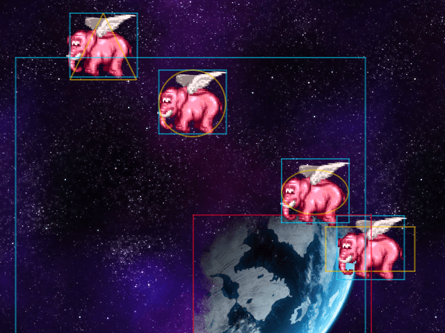

Phaser 3 Debug Draw Plugin
==========================

It shows:

- Game Objects (origin, bounds, rotation, input)
- Bitmap Masks
- Input pointers
- Camera bounds, deadzone, and follow target
- Mesh and Rope vertices

[Demo](https://codepen.io/samme/full/zMZyOM/) | [Screenshots](https://phaser.discourse.group/t/debug-draw-plugin-phaser-3/4480)

Use
---

```javascript
new Phaser.Game({
  plugins: {
    scene: [
      { key: 'DebugDrawPlugin', plugin: PhaserDebugDrawPlugin, mapping: 'debugDraw' }
    ]
  }
});
```

Options
-------

Set properties on the plugin instance. See [source](src/main.js) or `console.log(this.debugDraw)` from the scene.

Browser
-------

```html
<script src='path/to/phaser-plugin-debug-draw.umd.js'></script>
```

Then use the global `PhaserDebugDrawPlugin`.

ES Module
---------

```javascript
import DebugDrawPlugin from 'phaser-plugin-debug-draw';
```

Load on Demand
--------------

```javascript
// From scene `preload()`
this.load
  .setBaseURL()
  .setPath()
  .setPrefix()
  .scenePlugin(
    'PhaserDebugDrawPlugin',
    'https://cdn.jsdelivr.net/npm/phaser-plugin-debug-draw@5.0.0',
    'debugDraw',
    'debugDraw'
  );
```

Load from Console
-----------------

```javascript
game.scene
  .getScenes(true)[0]
  .load
  .setBaseURL()
  .setPath()
  .setPrefix()
  .scenePlugin(
    'PhaserDebugDrawPlugin',
    'https://cdn.jsdelivr.net/npm/phaser-plugin-debug-draw@5.0.0',
    'debugDraw',
    'debugDraw'
  )
  .start();
```
